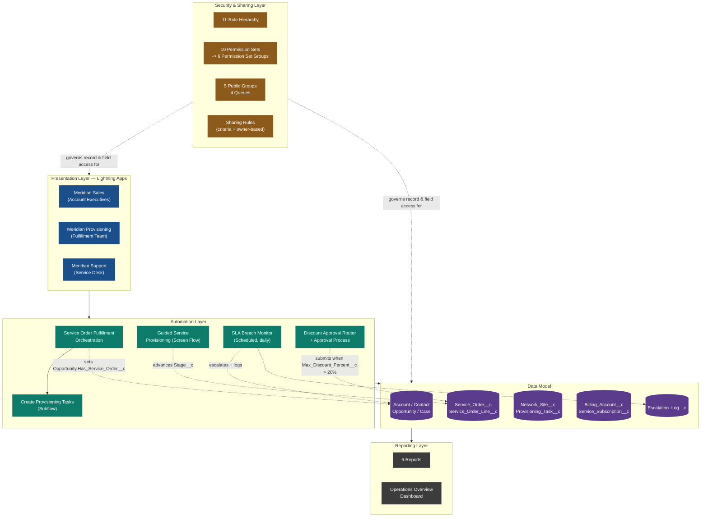

# Architecture Overview

Layered view of the Meridian Communications org: what the user touches, what
runs in the background, what holds the data, and what controls who can see it.

**Reading this diagram:** the three Lightning Apps are how each functional
team enters the system; the automation layer reacts to what they do
(creating a Service Order fans out into provisioning tasks; a discount
crossing 20% halts the order until approved; an unattended SLA breach
escalates itself overnight); everything is stored against the data model in
the middle; and none of it is visible to a user unless the security layer
says so — role hierarchy for vertical visibility, sharing rules for lateral
visibility, and Permission Set Groups for what a user can actually _do_ once
they can see a record.
