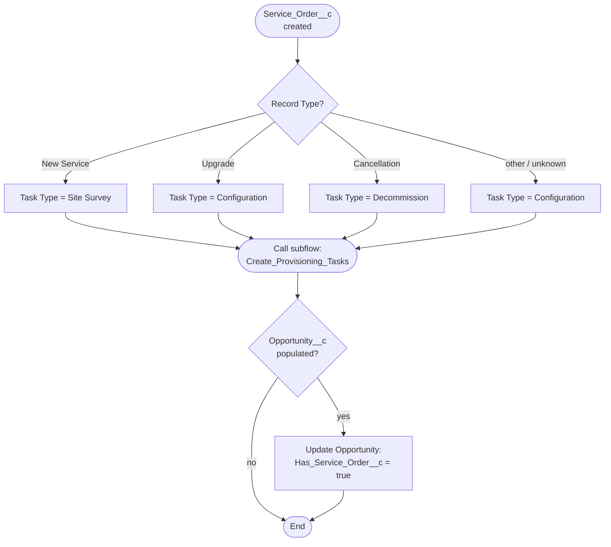
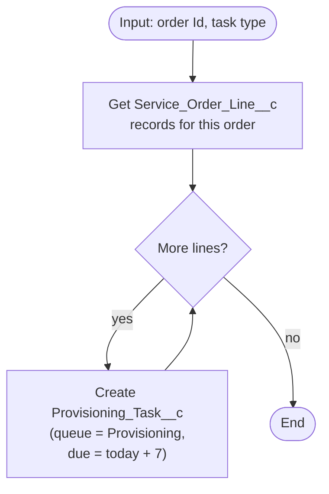
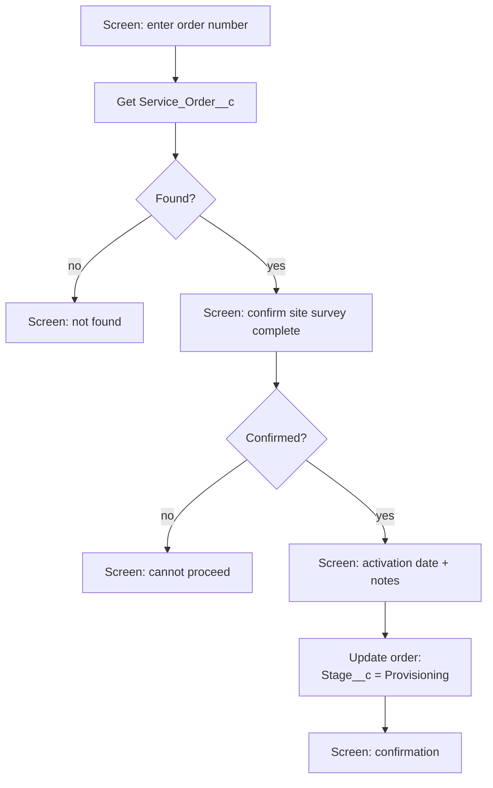
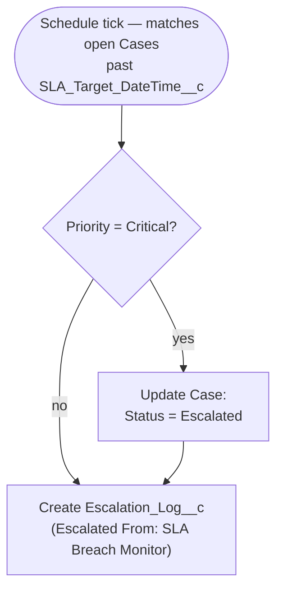
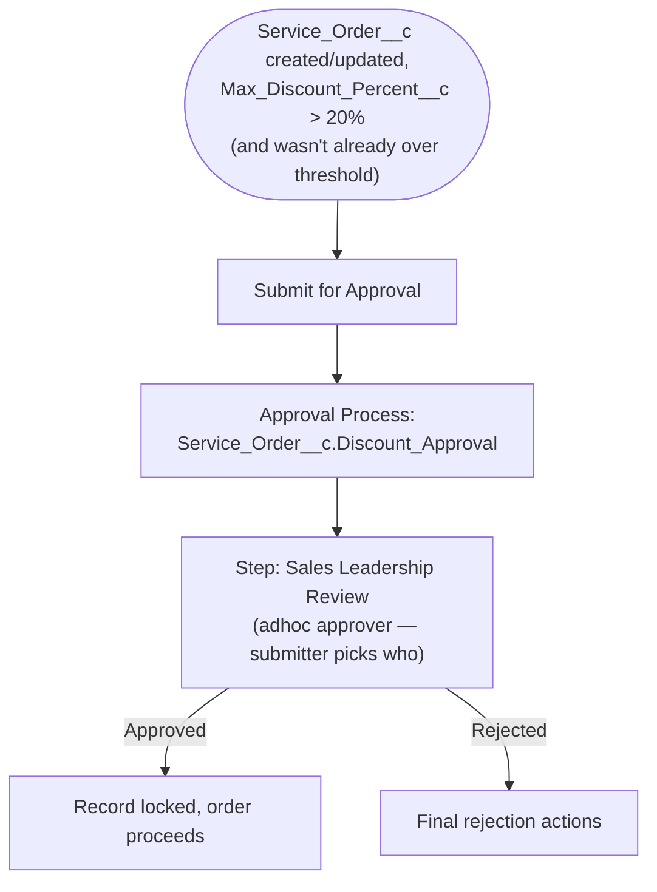

# Automation

Six Flows plus one Approval Process. Five of the flows correspond to a named
business-process automation; the sixth (`Sync_Billing_Account_Flag`) is a
small supporting utility, called out separately below.

## 1. Service Order Fulfillment Orchestration

## 2. Create Provisioning Tasks (subflow)

## 3. Guided Service Provisioning (screen flow)

## 4. SLA Breach Monitor (scheduled, daily 06:00)

## 5. Discount Approval Router + Approval Process

`Max_Discount_Percent__c` is a **roll-up summary (MAX)** over
`Service_Order_Line__c.Discount_Percent__c` — only possible because that
line-item relationship is Master-Detail (the one deliberate exception in an
otherwise all-Lookup custom object model; see `entity-relationship.md`).

## Utility flow (not one of the 5 above)

**Sync Billing Account Flag** — record-triggered on `Billing_Account__c`
create, sets `Account.Has_Billing_Account__c = true` on the parent. Exists
for the same reason as the Opportunity shadow field in flow 1: the
underlying relationship is a Lookup, not Master-Detail, so no native
roll-up is available for the "Business Customer accounts need a Billing
Account" validation rule to check directly.
