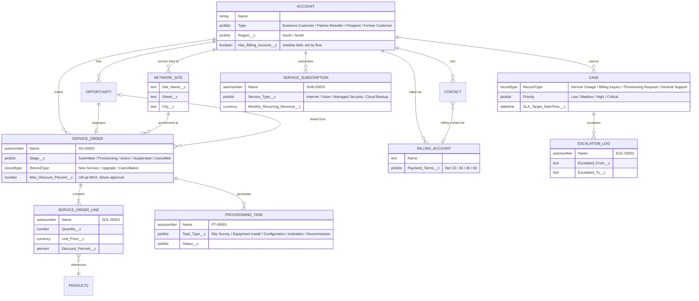

# Entity Relationship Diagram

Core data model for Meridian Communications. Standard Salesforce objects
(Account, Contact, Opportunity, Case, Product2) extended with 7 custom
objects covering the fulfillment and billing lifecycle.

**Relationship types that matter architecturally:**

- `Service_Order__c` → `Service_Order_Line__c` is the only **Master-Detail**
  relationship in the model — deliberately, so `Max_Discount_Percent__c` can
  be a native roll-up summary that drives the Discount Approval process.
- Every other custom-object relationship is a **Lookup**, kept independently
  sharable rather than cascading. Where a validation rule needed to check
  across one of those Lookups (Opportunity ↔ Service Order, Account ↔
  Billing Account), a small boolean "shadow field" set by a flow stands in
  for the roll-up a Master-Detail would have given for free — see
  `ARCHITECTURE.md`.
