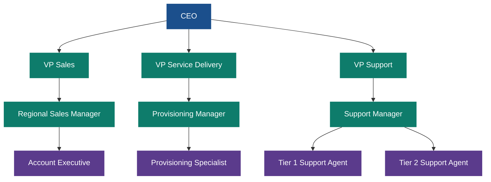
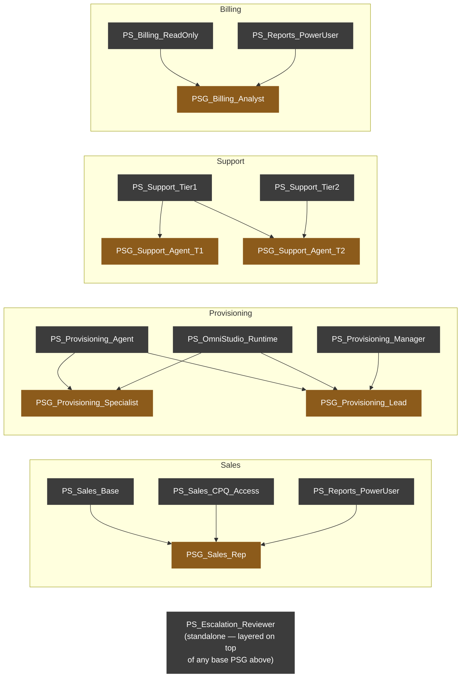
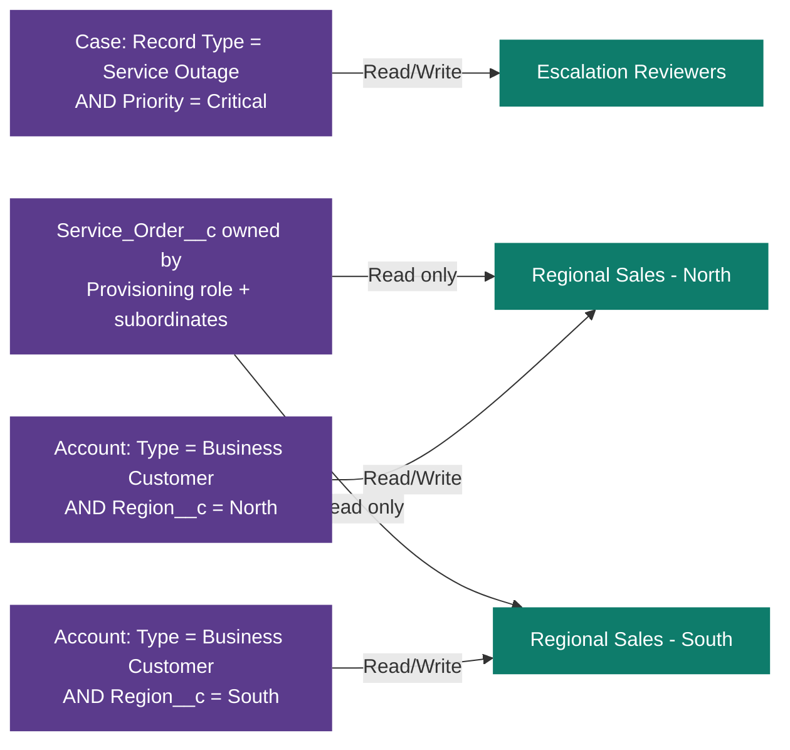

# Security Model

Three independent mechanisms combine to control access: the **role
hierarchy** (vertical — managers see their team's records), **sharing
rules** (lateral — specific groups see records they don't own, for a
specific business reason), and **Permission Set Groups** (functional — what
a user can actually do with a record once they can see it).

## Role hierarchy

## Permission Set Groups (functional access)

## Sharing rules (lateral access, layered on top of Private OWD)

**Why Private OWD + explicit sharing rules, instead of a more open default:**
every custom object here defaults to `Private` (see each object's
`sharingModel` in `force-app/main/default/objects/*/`). That only makes
sense paired with sharing rules that deliberately re-open specific,
justified slices of visibility — which is what the three rules above do.
An org-wide default of `Public Read/Write` would make the sharing rules
meaningless (everyone could already see everything), so the two decisions
are made together, not independently.
